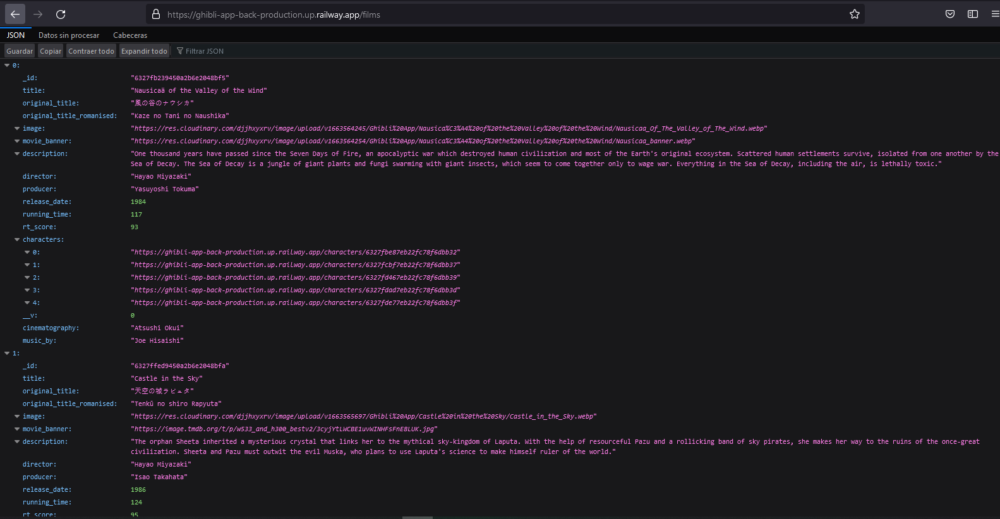

# STUDIO GHIBLI API
## Tabla de Contenidos

- [STUDIO GHIBLI API](#studio-ghibli-api)
  - [Tabla de Contenidos](#tabla-de-contenidos)
  - [Preview](#preview)
    - [Screenshot](#screenshot)
  - [Proyecto](#proyecto)
    - [Links](#links)
  - [Proceso](#proceso)
    - [Construido con:](#construido-con)
    - [Recursos Utilizados](#recursos-utilizados)

## Preview

### Screenshot

## Proyecto

Este proyecto se trata del backend para la APP Studio Ghibli

### Links

- Repositorio: [Solution](https://github.com/fabioalcocer/studio-ghibli-api)
- Live Site URL: [Live App]()

## Proceso

### Construido con:

- Express
- MongoDB
- Mongoose
- MongoDBCompass
- Mongoose-sequence
- Mongo atlas

### Recursos Utilizados

- [Mongooose Docs](https://mongoosejs.com/docs/)
- [MongoDB Atlas](https://www.mongodb.com/docs/atlas/getting-started/)
- [Express API Reference](https://expressjs.com/es/4x/api.html)
- [Express MDN docs](https://developer.mozilla.org/es/docs/Learn/Server-side/Express_Nodejs)
- [Reference npmjs mongoose-sequence](https://www.npmjs.com/package/mongoose-sequence)